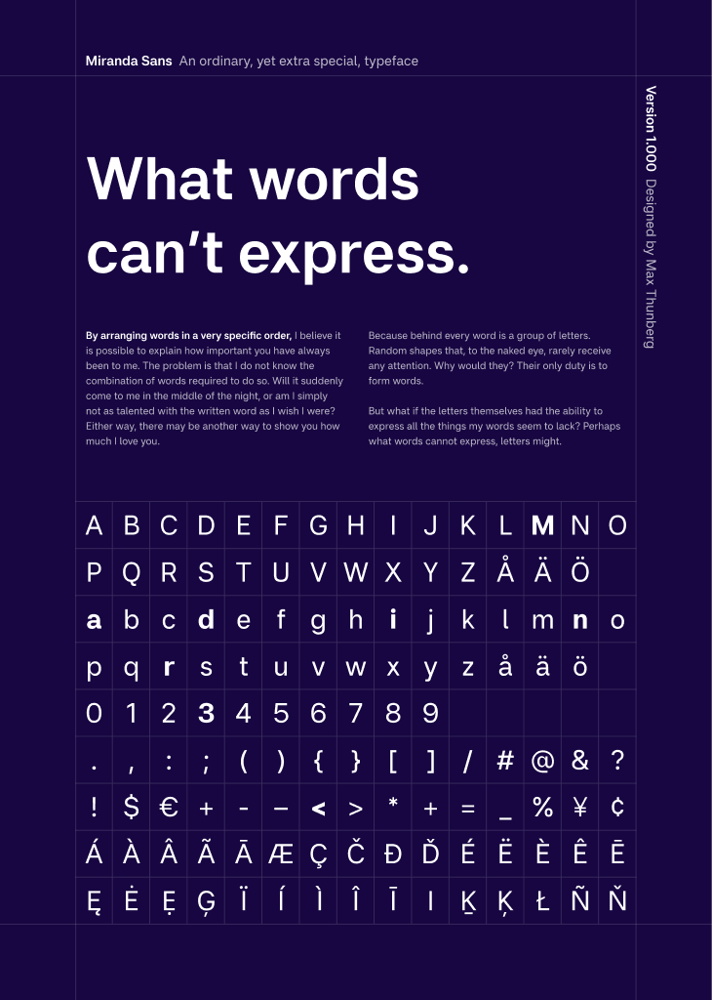

# Miranda Sans

Miranda Sans is a contemporary sans-serif typeface designed for clarity, balance, and everyday digital use.

The typeface is built with an emphasis on open shapes, consistent rhythm, and predictable behavior across weights, making it suitable for interfaces, long-form text, and editorial contexts.

Miranda Sans is available as a variable font and includes carefully crafted static instances for environments where variable fonts are not supported.

<br>

[](https://maxthunberg.com/miranda-sans)


## Features

- Variable font with a continuous weight axis
- Optimized for screen readability
- Balanced proportions and open apertures
- Carefully tuned spacing and kerning
- Tabular and proportional figures
- Common Latin ligatures
- Broad Latin language support

## Variable font

Miranda Sans is provided as a [variable font](https://github.com/maxthunberg/miranda-sans/tree/main/ofl/mirandasans) with a `wght` axis, allowing precise control over typographic weight while reducing file size and complexity.

Variable fonts enable smoother typographic hierarchies and more flexible design systems compared to traditional static fonts.

## Static fonts

[Static instances](https://github.com/maxthunberg/miranda-sans/tree/main/ofl/mirandasans/static) are included for compatibility with older environments and workflows that do not support variable fonts.

## Usage

### CSS example

```css
@font-face {
  font-family: "Miranda Sans";
  font-style: normal;
  font-weight: 100 900;
  font-display: swap;
  src: url("MirandaSans[wght].woff2") format("woff2");
}

body {
  font-family: "Miranda Sans", Arial, Helvetica, sans-serif;
}
```
Miranda Sans is a [variable font](https://github.com/maxthunberg/miranda-sans/tree/main/ofl/mirandasans) and is in addition also distributed as a set of traditional distinct font files in the following styles:

| Roman (upright) name | Italic name          | Weight
| -------------------- | -------------------- | ------------
| Regular              | Italic               | 400
| Medium               | Medium Italic        | 500
| Semi Bold            | Semi Bold Italic     | 600
| Bold                 | Bold Italic          | 700

## About designer

Miranda Sans is designed by [Max Thunberg](https://maxthunberg.com/)
