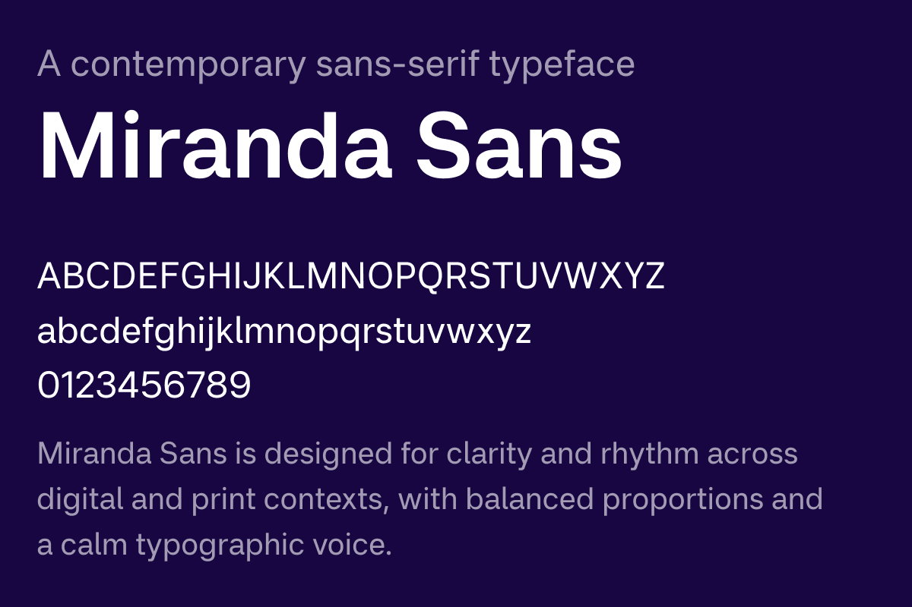

# Miranda Sans

Miranda Sans is a contemporary sans-serif typeface designed for clarity,
editorial rhythm, and a strong typographic voice across digital and print contexts.

Designed by Max Thunberg.
